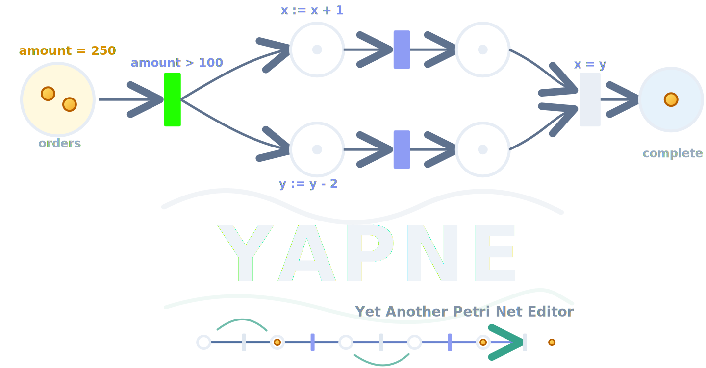

# YAPNE - Yet Another Petri Net Editor



YAPNE is a browser-based editor, simulator, and analysis environment for Petri nets and Data Petri nets.

The project has two usable parts:

- A reusable JavaScript library in `src/` for Petri net models, rendering, editing, simulation, import/export, and extensions.
- A Vite frontend in `index.html`, `app.js`, `styles/`, and the UI integration modules.

The frontend uses the same library files that can be imported by another editor or application.

Inspired by [I love Petri Nets](https://www.fernuni-hagen.de/ilovepetrinets/fapra/wise23/rot/index.html).

## Status

This project is under active development. Some advanced features are experimental, especially probabilistic execution, WebPPL-based constraint solving, Python import, and formal verification UI flows.

## Features

### Editor

- Canvas editor for places, transitions, and arcs.
- Regular, inhibitor, reset, and read-style arc handling.
- Tokens, arc weights, labels, priorities, delays, silent transitions, capacities, and final markings.
- Pan, zoom, fit-to-canvas, reset view, grid display, snap-to-grid, and optional color inversion.
- Multi-selection, box selection, copy/paste, delete, undo/redo, and action history.
- Ghost element workflow for quickly creating connected places and transitions.
- Auto-connect support for nearby compatible nodes.
- Automatic layout using the internal BPMN-style layout algorithm.
- Properties, simulation, and verification side panels.
- Built-in examples and workflow tutorials.

### Simulation

- Step-by-step firing of enabled transitions.
- Automatic simulation with reset to captured initial marking.
- Enabled transition highlighting.
- Final marking checks.
- Deadlock detection.
- Probabilistic step execution with uniform or weighted scheduling.
- Data-aware simulation for Data Petri nets.

### Data Petri Nets

- Data variables with `int`, `bool`, and `real` types.
- Data-aware transitions with guards and postconditions.
- Guard language parser, validator, evaluator, and SMT emitter.
- Variable valuation display and reset.
- Constraint-style postconditions with optional WebPPL solving.
- WebPPL code generation for probabilistic DPN analysis.

### Import And Export

- JSON load/save for YAPNE models.
- PNML import and export.
- PNG export from the current canvas.
- Event log generation.
- Event log export as CSV, JSON, and XES.
- Python-to-DPN import dialog and transpiler.

### Verification And Analysis

- Reachability and deadlock-related model inspection.
- Soundness verification UI for the Suvorov-Lomazova approach.
- Z3-backed SMT support for verification modules.
- Counterexample trace visualization for verification results.

### Accessibility And Settings

- Editor settings stored in local storage.
- Configurable zoom sensitivity, pan sensitivity, grid size, auto-connect distance, grid visibility, snap-to-grid, and canvas color inversion.
- Canvas accessibility integration modules.

## Run The Frontend

Install dependencies:

```bash
npm install
```

Start the development server:

```bash
npm run dev
```

Build the production bundle:

```bash
npm run build
```

Preview a production build:

```bash
npm run preview
```

`npm run build` runs `npm run bundle:webppl` first. The WebPPL bundle is used by probabilistic execution and constraint-solving features.

## Project Structure

```text
.
|-- index.html                         # Frontend shell
|-- app.js                             # Frontend bootstrap and extension setup
|-- src/
|   |-- petri-net-simulator.js         # Core model, renderer, editor, and API
|   |-- petri-net-app.js               # Main application class used by the frontend
|   |-- event-log-generator.js         # Basic event log generation
|   |-- properties-panel.js            # Element properties panel
|   |-- simulation-dashboard.js        # Simulation panel
|   |-- verification-panel.js          # Verification panel shell
|   `-- extensions/
|       |-- dpn-model.js               # Data Petri net model classes
|       |-- dpn-api.js                 # Data Petri net API
|       |-- dpn-renderer.js            # Data-aware rendering
|       |-- dpn-ui.js                  # Data variable and expression UI
|       |-- dpn-integration.js         # Frontend DPN integration
|       |-- guard-language/            # Guard parser, evaluator, validator, SMT emitter
|       |-- pnml-importer.js           # PNML import
|       |-- png-exporter.js            # PNG export
|       |-- probabilistic-execution.js # Probabilistic execution engine
|       |-- webppl-code-generator.js   # WebPPL code generation
|       |-- python-dpn-transpiler.js   # Python-to-DPN conversion
|       `-- soundness-verification/    # Suvorov-Lomazova verification modules
|-- styles/                            # Frontend styles
|-- public/                            # Static assets, examples, WebPPL, Z3
|-- docs/                              # Documentation and diagrams
`-- tests/                             # Browser-oriented and module examples
```

## Library Usage

The core library is separate from the YAPNE frontend. Use it directly when building another editor, embedding a Petri net canvas, or generating and simulating models programmatically.

### Core Petri Net API

```html
<canvas id="net"></canvas>
<script type="module">
  import { PetriNetAPI } from "./src/petri-net-simulator.js";

  const canvas = document.getElementById("net");
  const api = new PetriNetAPI(undefined, "Order Process");
  const editor = api.attachEditor(canvas);

  const start = api.createPlace(120, 160, "start", 1);
  const approve = api.createTransition(260, 160, "approve");
  const done = api.createPlace(400, 160, "done", 0, 1);

  api.createArc(start, approve, 1, "regular");
  api.createArc(approve, done, 1, "regular");

  console.log(api.getEnabledTransitions());
  api.fireTransition(approve);

  const json = api.exportAsJSON();
  const pnml = api.exportAsPNML();

  editor.setMode("select");
  editor.setSnapToGrid(true, 10);
</script>
```

Useful core imports:

```js
import {
  PetriNetAPI,
  PetriNetEditor,
  PetriNetRenderer,
  PetriNet,
  Place,
  Transition,
  Arc
} from "./src/petri-net-simulator.js";
```

Common `PetriNetAPI` methods:

- `attachEditor(canvasElement)`
- `createPlace(x, y, label, tokens, finalMarking)`
- `createTransition(x, y, label)`
- `createArc(sourceId, targetId, weight, type)`
- `removeElement(id)`
- `setLabel(id, label)`
- `setPosition(id, x, y)`
- `setPlaceTokens(id, tokens)`
- `setPlaceFinalMarking(id, finalMarking)`
- `setArcWeight(id, weight)`
- `setArcType(id, type)`
- `getEnabledTransitions()`
- `fireTransition(id)`
- `autoFireEnabledTransitions(maxSteps)`
- `detectDeadlocks()`
- `checkFinalMarkings()`
- `fitToCanvas(padding)`
- `autoLayout(options)`
- `exportAsJSON()`
- `PetriNetAPI.importFromJSON(json)`
- `exportAsPNML()`

### Data Petri Net API

```html
<canvas id="dpn"></canvas>
<script type="module">
  import { DataPetriNetAPI } from "./src/extensions/dpn-api.js";
  import { DataPetriNetRenderer } from "./src/extensions/dpn-renderer.js";

  const canvas = document.getElementById("dpn");
  const api = new DataPetriNetAPI(undefined, "Data Example");
  const editor = api.attachEditor(canvas);

  editor.renderer = new DataPetriNetRenderer(canvas, api.petriNet);

  const order = api.createPlace(120, 180, "order", 1);
  const check = api.createDataTransition(
    280,
    180,
    "check",
    "amount > 100",
    "approved' = true"
  );
  const complete = api.createPlace(440, 180, "complete", 0, 1);

  api.createDataVariable("amount", "int", 250);
  api.createDataVariable("approved", "bool", false);
  api.createArc(order, check);
  api.createArc(check, complete);

  await api.fireTransition(check);
  console.log(api.getDataValuation());
</script>
```

Useful DPN imports:

```js
import { DataPetriNetAPI } from "./src/extensions/dpn-api.js";
import { DataPetriNet, DataAwareTransition, DataVariable } from "./src/extensions/dpn-model.js";
import { DataPetriNetRenderer } from "./src/extensions/dpn-renderer.js";
```

Common `DataPetriNetAPI` methods:

- `createDataVariable(name, type, initialValue, description)`
- `getDataVariable(id)`
- `getDataVariables()`
- `removeDataVariable(id)`
- `updateDataVariableValue(id, value)`
- `createDataTransition(x, y, label, precondition, postcondition)`
- `setTransitionPrecondition(transitionId, precondition)`
- `setTransitionPostcondition(transitionId, postcondition)`
- `getDataValuation()`
- `resetDataVariables()`
- `fireTransition(id)`
- `autoFireEnabledTransitions(maxSteps)`
- `exportDataVariablesToJSON()`
- `importDataVariablesFromJSON(json)`
- `DataPetriNetAPI.importFromJSON(json)`

### Event Log Generation

```js
import { EventLogGenerator } from "./src/event-log-generator.js";

const generator = new EventLogGenerator(api.petriNet, {
  startTimestamp: new Date(),
  timeUnit: "minutes",
  caseArrivalRate: 10,
  arrivalDistribution: "exponential",
  transitionSelectionStrategy: "priority",
  seed: 1234
});

await generator.simulateCases(100, 1000);

const csv = generator.exportToCSV();
const json = generator.exportToJSON();
const xes = generator.exportToXES();
```

### Probabilistic Execution

```js
import { ProbabilisticExecutionEngine } from "./src/extensions/probabilistic-execution.js";

const engine = new ProbabilisticExecutionEngine({
  scheduler: "uniform",
  seed: 1234,
  maxSteps: 1000
});

const stepResult = await engine.step(api.petriNet);
const runResult = await engine.runFullSimulation(api.petriNet, {
  validateGoal: false
});
```

Related modules:

- `src/extensions/probabilistic-event-log-generator.js`
- `src/extensions/webppl-code-generator.js`
- `src/extensions/probabilistic-integration.js`

### Frontend Application

The shipped frontend initializes `PetriNetApp` and then installs extensions in `app.js`.

```js
const app = new window.PetriNetApp();
window.petriApp = app;
```

For a custom frontend, import only the modules you need. A minimal editor needs `PetriNetAPI` plus a canvas. A full YAPNE-like frontend also wires `PetriNetApp`, panels, DPN integration, PNML import, PNG export, event log integration, verification UI, and probabilistic integration.

## Extension Notes

Extensions are plain ES modules. Most frontend integrations follow this pattern:

1. Import the extension module after the core simulator.
2. Create or replace API, renderer, or UI objects as needed.
3. Attach the extension to the current `PetriNetApp` instance.
4. Re-render and update side panels after model changes.

The DPN integration is the main example of this pattern:

```js
import { DataPetriNetIntegration } from "./src/extensions/dpn-integration.js";

window.dataPetriNetIntegration = new DataPetriNetIntegration(window.petriApp);
```

## Model Formats

YAPNE JSON stores the full editor model, including places, transitions, arcs, labels, markings, final markings, and DPN data where applicable.

PNML support is intended for interoperability with other Petri net tools. Some YAPNE-specific DPN and UI metadata may not have a direct PNML equivalent.

## Examples

Example models are stored in `public/examples/`. They include basic soundness examples, violation examples, concurrency examples, and Data Petri net models such as order processing, emergency triage, and Fibonacci.

## Documentation

- `docs/user_manual.md`
- `docs/high_level_functions.txt`
- `docs/low_level_functions.txt`
- `docs/architecture.png`
- `docs/data_petri_nets.png`
